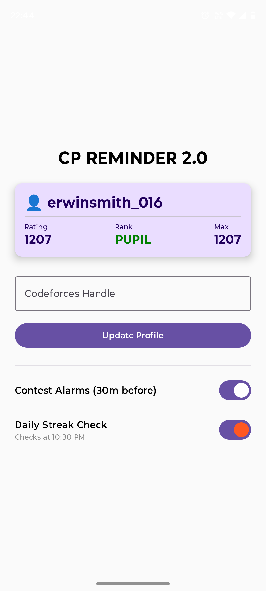

# 🏆 CP Reminder 2.0

**Never miss a Codeforces contest or break your daily streak again.**

CP Reminder 2.0 is a smart Android application built with **Jetpack Compose** and **Kotlin**. It automatically tracks your Codeforces schedule and ensures you stay consistent with your competitive programming journey.

<p align="center">
  
  &nbsp;&nbsp;&nbsp;&nbsp;
</p>

## ✨ Key Features

### 1. 📊 Live User Stats
- Fetches real-time data from the **Codeforces API**.
- Displays your Handle, Current Rating, Max Rating, and Rank.
- **Dynamic UI:** The rank color changes automatically (Green for Pupil, Blue for Expert, Red for Grandmaster, etc.).

### 2. ⏰ Smart Contest Alarms
- Automatically fetches upcoming contests in the background using **WorkManager**.
- Schedules a **Loud Alarm** exactly **30 minutes before** any contest starts.
- **Android 14 Ready:** Uses a Foreground Service with `mediaPlayback` type to ensure the alarm rings even on the latest Android versions.

### 3. 🔥 Daily Streak Guardian
- Runs a background check every night at **10:30 PM**.
- Checks if you have solved at least **one problem** today.
- **0 Submissions?** The alarm rings to wake you up and save your streak!
- **Solved?** The app stays silent and lets you sleep.

### 4. 🛑 Robust Alarm System
- **Heads-Up Notification:** High-priority pop-up with an instant "STOP ALARM" button.
- **Kill Switch:** Uses a dedicated BroadcastReceiver to kill the service instantly when you dismiss the alarm.
- **Zombie Check:** Intelligent logic prevents the alarm from ringing accidentally when you restart the phone or app.

## 🛠️ Tech Stack

* **Language:** Kotlin
* **UI:** Jetpack Compose (Material 3)
* **Networking:** Retrofit & Gson (Codeforces API)
* **Background Tasks:** WorkManager (Periodic Sync)
* **Local Storage:** DataStore Preferences
* **Services:** Foreground Service & BroadcastReceivers
* **Concurrency:** Coroutines & Flow

## 🚀 How to Run

1.  **Clone the Repository:**
    ```bash
    git clone [https://github.com/YourUsername/CPReminder2.0.git](https://github.com/YourUsername/CPReminder2.0.git)
    ```
2.  **Open in Android Studio:**
    * File -> Open -> Select the folder.
3.  **Sync Gradle:**
    * Let Android Studio download the dependencies.
4.  **Run:**
    * Connect your phone or use an Emulator.
    * Click the green "Run" button.

## 📱 Permissions Used

* `INTERNET`: To fetch contest data and user stats.
* `POST_NOTIFICATIONS`: To show the alarm pop-up.
* `FOREGROUND_SERVICE`: To play the alarm sound continuously.
* `SCHEDULE_EXACT_ALARM`: To ensure the contest alarm rings at the exact right minute.

## 👨‍💻 Author

**Ganesh Karthik (GK)**
* IIIT Jabalpur
* Connect with me on [LinkedIn](www.linkedin.com/in/ganeshkarthikb) 

---
*Built with ❤️ for the Competitive Programming Community.*


