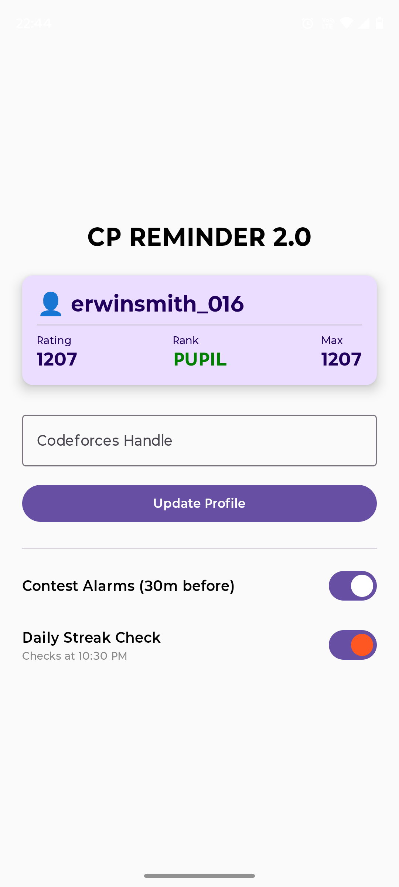

# CP Reminder 2.0

An Android app that helps competitive programmers stay consistent by reminding them about **Codeforces contests** and their **daily submissions**.

<p align="center">
  
</p>

## Features

- **Contest Reminders**  
  Fetches upcoming Codeforces contests and sets an alarm 30 minutes before each contest.

- **Daily Streak Reminder**  
  Checks at 10:30 PM whether you have made a Codeforces submission that day and reminds you if you haven't.

- **Codeforces Stats**  
  Displays your handle, rating, max rating, and rank using the Codeforces API.

- **Reliable Background Execution**  
  Uses WorkManager, exact alarms, foreground services, and BroadcastReceivers to handle Android background restrictions.

## Tech Stack

- **Kotlin**
- **Jetpack Compose**
- **WorkManager & AlarmManager**
- **Foreground Services & BroadcastReceivers**
- **Retrofit & Gson**
- **DataStore**
- **Coroutines & Flow**
- **Codeforces API**

## Featured

Featured in **GENZ TECH Campus Radar #11** for the technical implementation of reliable Codeforces reminders on Android.

[Read the feature](https://genztech.blog/p/cp-reminder-iiit-jabalpur-codeforces-streak/)

## Run Locally

1. Clone the repository.
2. Open the project in Android Studio.
3. Sync Gradle dependencies.
4. Connect an Android device or start an emulator.
5. Run the app.

## Author

**Ganesh Karthik**  
IIIT Jabalpur
```
